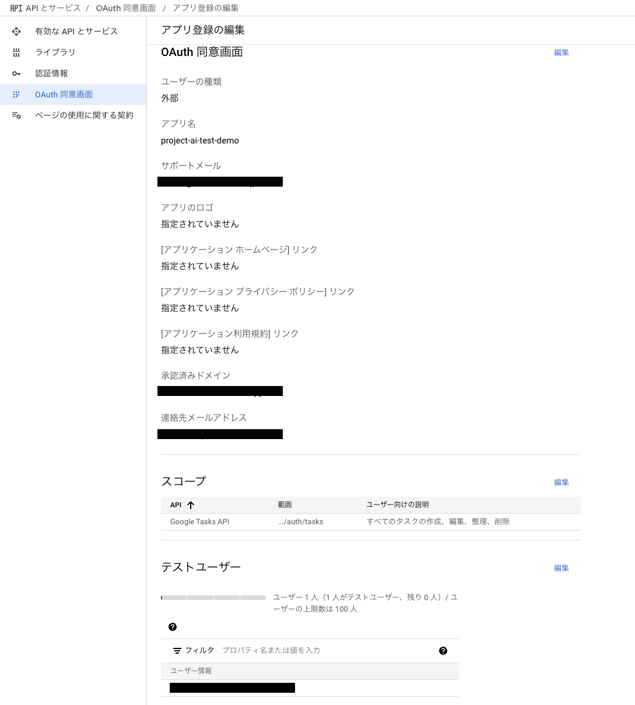
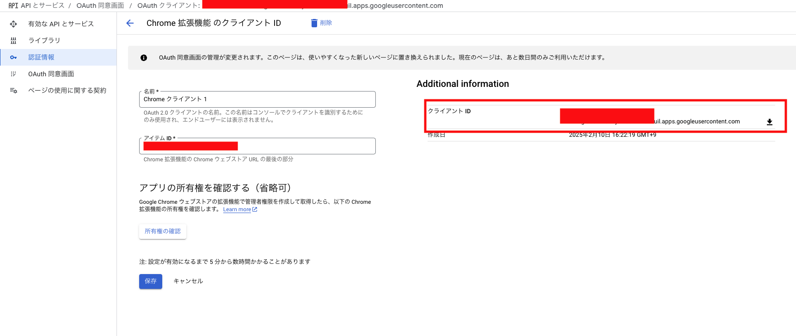

# ai-hackason-gemini
https://zenn.dev/hackathons/2024-google-cloud-japan-ai-hackathon

AI Agent Hackathon with Google Cloud参加レポジトリ。
## setup
[OAuth準備](#OAuth準備)を参考にしてください。
### インストール
```
npm install
```
## development
```
npm run dev
```
## build
```
npm run build
```

## install
`build` ディレクトリに成果物ができます。下記を参考にChrome拡張をインストールします。

refer: https://developer.chrome.com/docs/extensions/get-started/tutorial/hello-world?hl=ja#load-unpacked

## server
`server` ディレクトリにサーバーサイドのコードがあります。

### OAuth準備
- OAuth同画面の設定
  - 公開ステータスがテストの場合は、テスト用にgmailアカウントをテストユーザーとして追加する必要があります
    
- OAuthクライアントの認証情報を作成する
  - `manifest.json` client_id は自分のものに変更してください。
  - Google CloudでOAuth2.0のクライアントIDを取得してください。
    - refer: https://developer.chrome.com/docs/extensions/how-to/integrate/oauth?hl=ja
    
- Google Tasks APIを有効にする
   - https://console.cloud.google.com/apis/api/tasks.googleapis.com/
- .envに記載している`VITE_API_URL`を書き換えてください。
