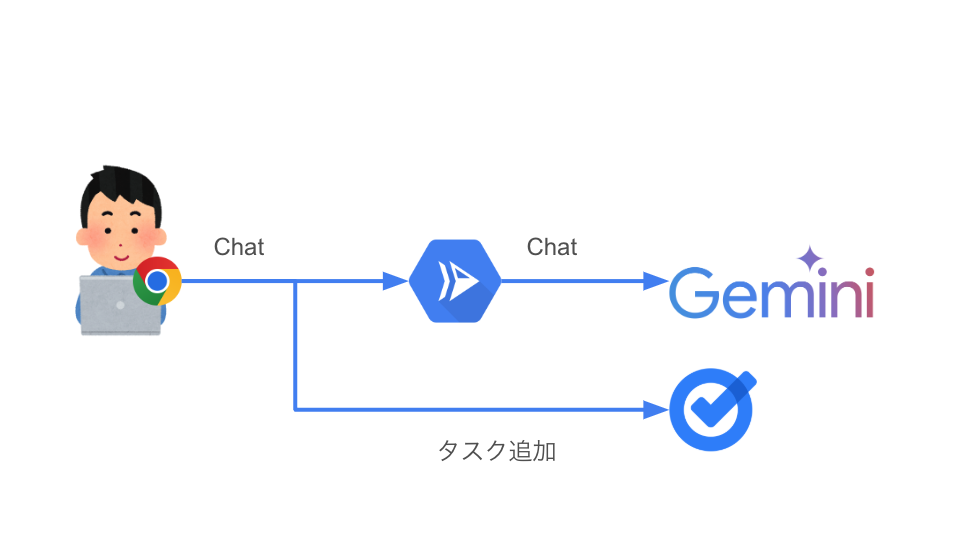

# AI Agent Hackathon with Google Cloud 参加記事：Geminiでタスク追加

本記事では、AI Agent Hackathon with Google Cloud に参加するために開発したプロジェクト「Geminiでタスク追加」について、以下の内容を説明します。

---

## 1. プロジェクト概要
プロジェクトの名前：Geminiでタスク追加

Geminiを使って、ブラウザで表示しているページ情報を取得し、Google Tasksにタスクを追加するChrome拡張を開発する。

### デモ動画
まずはデモ動画をどうぞ。

[youtube](https://youtu.be/HfFCl1FwJsU)

#### 使用例１: レシピサイトでレシピの材料を買い物リストとしてタスク追加する

cookpad様のサイトを例にさせていただきました。

分量を含める指示を出さないと、タスクに分量が含まれないので、分量を含めるように指示を出しています。

#### 使用例2: ハッカソンの提出に必要なものをリストアップしてタスク追加する

### ユーザー像と課題
普段からPCでブラウザを使い、タスク管理ツールを使っている。タスクの追加は、手動で行なっている。
手動で追加するのが煩わしいことがあるので、AIが手伝ってくれたらいいのになぁと思っている。

### 課題へのソリューション
Geminiを使って、タスクの追加をAIに任せることで、手間を省くことができる。
具体的には、Chrome拡張を使ってブラウザで表示しているページ情報を取得する。そして、Geminiに指示を出して、タスクの一覧を抽出する。最後にGoogle Tasksにタスクを追加する。
このようなソリューションである。

### システム アーキテクチャ図

| システム要素 | 説明 |
| --- | --- |
| Chrome拡張 | ブラウザで表示しているページ情報を取得する Googleアカウントの認証を行う Google Tasksにタスク追加する |
| Gemini | 生成AI |
| Google Tasks | タスク管理ツール |
| Cloud Run | Chrome拡張からのリクエストを受け取り、Geminiにリクエストを送る。 |

### このハッカソンに参加するまでの経緯
このハッカソンが発表されてすぐに参加しようと思ったが、その時はまだアイデアが浮かばなかった。
なかなかいいアイデアが浮かばないので、取り組まないまま日々は過ぎていった。年明けになって、自分が作っているツールでスクレイピングを従来のXPathやSelectorでやっていたのを、LLMにやらせてみたらうまく行くだろうかと、自前で建てているOllamaでgemmaなどのいくつかのOSSのLLMを使ってみたが、うまくいかなかった。ハルシネーションおこしたりうまくデータ抽出ができなかった。
そんなこんなで時間が過ぎて、2月6日になってGemini2.0がGAになったことを知った。それをみて、もう一度スクレイピングに使えそうかを試してみたら、かなり思った通りの結果が得られた。それを見て、このハッカソンに参加しようと思った。
しかし、スクレイピングを題材にしてハッカソンに参加するのは気が引けた。なぜなら、昨今のスクレイピングに対する風当たりが強そうに思っていたからだ。噂話程度でしか知りませんが、とあるAIの会社が、`robots.txt`をみずに大量のクローリングをしていてニュースになっているのを目にした。その後、CDNの会社がAIクローラーを一括でブロックする機能をリリースされていた。
こうした状況で、スクレイピングを題材にするのは避けようと思ったのだ。すこし、言葉の定義を厳密にしてクローリング（HTMLの取得）とスクレイピング（HTMLからデータを抽出）を分けるなら、クローリングすることが問題視されている。よくスクレイピングするという言葉の意味に、暗黙的にクローリングが含まれていることあるような気がするので。

もう一つ、このハッカソンに参加するにあたって、AI Agentというテーマが引っかかった。
そもそも、AI Agentとはなんだろうか？単に、スクレイピングをLLMにやらせても、それはただのアシスタント止まりなのではないか？という気がしていたからだ。
そこで、AI エージェントの定義をハッカソンのページで再確認した。

> まだ、AI エージェントにはっきりとした定義はありません。ユーザーの要望や状況を理解し、人間のように柔軟にタスクを実行するシステム。推論、計画、記憶… どんな能力を持たせ、他のシステムとどう連携させるのか？あなたの自由な発想で、次世代の知的なパートナーを創造してください！

なるほど、能力を持たせるということと、他のシステムの連携をするものなのだな。

Geminiにも聞いた。

> AIエージェントは、一般的に以下のような定義で捉えられます。
広い意味での定義:
自律性: 環境を観察し、外部からの指示なしに、自身で目標を達成するための行動を決定・実行できる。
知能: 問題解決、学習、推論、計画などの知的行動を行う能力を持つ。
環境との相互作用: センサーを通じて環境を認識し、アクチュエーターを通じて環境に影響を与えることができる。
目標指向性: 設定された目標を達成するために行動する。
適応性: 環境の変化やフィードバックに基づいて行動を改善できる。
...

長いので、途中割愛。

> 環境との相互作用: センサーを通じて環境を認識し、アクチュエーターを通じて環境に影響を与えることができる。

私が注目したのは、この部分。AIエージェントに命令を与えたら、センサーを通じて自分で情報を取りに行って、命令に基づき意思決定を行い、それをアクチュエーターを通じて実行する。
この部分を重視してプロジェクトに取り組むことにした。

### 2月10日午前中
2月6日にハッカソンに参加しようと思い、スクレイピングに使えないかと、色々試しているうちに、締切日になってしまった。
Geminiがスクレイピングで高性能だと言うことは分かったので、それを使って何ができるかを考えてみた。また、HTMLを読むのが得意だと言うこともわかった。これはスクレイピングのツール開発で何度か試行錯誤の中で、トークン数を減らすためにMarkdownにもしたのだが、うまくいかないことがあった。これは、まだ体感的なものであり、HackerNewsなんかでも生成AI用にHTMLをマークダウンにする(Convert HTML DOM to semantic markdown for use in LLMs (github.com/romansky))[https://news.ycombinator.com/item?id=41043771]というツールを作ったというスレッドがあって、HTMLがいいのか、Markdownがいいのか議論されていて興味深かった。
このツールを試したが、私の感覚ではHTMLのほうが、良い性能が出ている感じがする。ただし、HTMLはトークン数が多いので、たまに最大トークンを超えてしまうことがある。そのため、Markdownにしたり、不要なタグを削ったりするのは有効な手段だと思う。具体的にエラーになったパターンは`img`タグにbase64の画像が埋め込まれているときだった。これがかなり大きなHTMLを構成しており、最大トークンを超えていた。他にも`style`,`script`タグなど文書構造に直接影響を及ぼさないものは削除してトークン数を節約した方が良いだろう。
HTMLから情報を抽出しようとすると、相性が良いのはブラウザだ。そこで、Chrome拡張にしてみようと思った。Chrome拡張を通じて、現在開いているタブのHTMLを取得すると言う能力をAIに与えることができる。
あとは、アクチュエーターの部分。これはAPI連携できる何かでよかった。誰でもわかるような内容にしたいと思ったので、タスク管理ツールとしてGoogle Tasksを選んだ。Google TasksはAPIが提供されているので、それを使ってタスクを追加することができる。Chrome拡張を開発する中でわかったのだが、Chrome拡張は現在ChromeをつかっているGoogleアカウントの認証トークンを取得することができるので、これもまた相性がよかった。サーバー側でOAuthを実装するは少し難儀だったので、都合が良かった。

### 開発してみた感想
- Geminiは早い
  - これまで使ってきたのはOllama系のもので、自前サーバで動かしていると言うのもあるが、とにかく推論が早い。
- Geminiは賢い
  - これまでのLLMは、あまり賢くないと感じていた。Geminiは本当に良い結果を返してくれます。
- GeminiのAPIが無料枠で提供してくれるの助かる
  - 無料枠で十分評価をするだけの量を提供してくれるのはありがたいです。
- AI SDKのtoolの機能がすごい
  - これはGeminiと直接関係しませんが、vercelが提供しているai-sdkを使いました。とにかく使いやすい。
  - 一番の驚きだったのは、toolをサーバー側だけではなく、クライアント側でも処理させることができることです。実際、このプロジェクトではHTMLの取得トリガーはサーバー側からトリガーされてクライアントに引数が渡され、ブラウザのタブのHTMLを取得しています。
  - タスク追加も同様にServer側からのトリガーで実行されます。
- Google TasksのAPIからBatchAPIの必要性について考えさせられた
  - Google TasksのAPIにはバッチで挿入するというAPIがなさそうで、さらにサブタスクにするというのには、moveというAPIを呼び出さないといけないようなので、タスクを1件につき2回のAPI Callを行う。タスクの数が多いと、API Callの数が増えるので、BatchAPIがあると便利だと思った。一度にたくさんAPIを呼び出すとクォータ制限に引っかかったりするので。

### 制限事項
- ハッカソン参加のデモ目的であるため、Chrome Web Storeには公開できない
- 開発者が自分専用のAPIサーバをたてて、自分専用のChrome拡張をビルドして利用する想定です

### このツールに対する想定ご意見・ご批判
- プロンプト打つのが手間なので、手でタスク追加した方が早そう
  - そうですね。プロンプトはテンプレートにするなどして、手間を減らす工夫が必要ですね。追加するタスクが少なければ、手動やコピペの方が早いと思います。アイテムの数が多くなってくると有効かもしれません。
- タスクの追加がうまくいかない
  - HTMLからうまく情報が抽出できなかったりすると、途中で止まってしまう現象があります。適切なエラーハンドリングが必要ですが、間に合いませんでした。原因がまだわかっていない。
- UIが微妙
  - はい。ほとんどUIに手を入れられませんでした。
  - tailwindを使っていたら[shadcn-chat](https://github.com/jakobhoeg/shadcn-chat)がOSSですぐに利用できて綺麗なコンポーネントなのでおすすめです。

## まとめ
生成AIを使ったハッカソンは2回目でしたが、いつも締切日ギリギリになってしまうのは、人間の性なのでしょうか。早め早めと思いつつ、いいアイデアがないなぁと思って今回はプロジェクト提出無理かなと思っていましが、締切日に急にやる気がでたりして、なんとか提出できました。
Geminiは本当にすごいです。使っていて楽しい、こんなこともできるんだと思わされる発見があります。また、LLMを利用した開発をしてみて、個人的な今後の課題も見えてきました。トークンを抑えるための最適化や、使いやすいUIとはどうするのが良いかなど。
