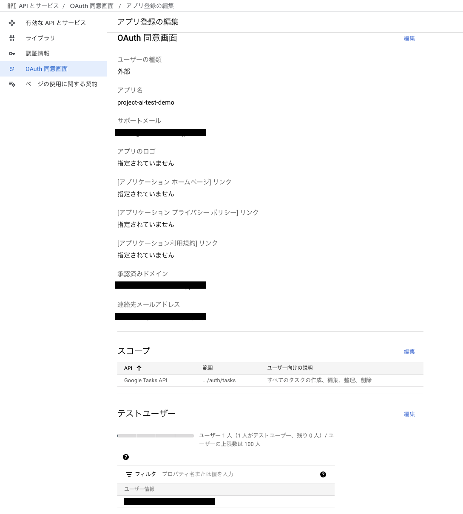

# OAuth準備
Google CloudでGoogle Tasks APIの連携ができるよう設定を行います。
まず、Chrome拡張のOAuth認証を行うために、OAuthクライアントの認証情報を作成します。
## OAuthの同意画面を設定する
- 下記の記事を参考にしてください。
- refer: https://developers.google.com/workspace/guides/configure-oauth-consent?hl=ja
- 公開ステータスがテストの場合は、テスト用にGoogleアカウントのメールアドレスをテストユーザーとして追加する必要があります
- スコープには`https://www.googleapis.com/auth/tasks`を追加してください。
  - 検索してヒットしない場合、手動で追加します。

## Chrome拡張のアクセス認証情報を作成する
- 下記の記事を参考にしてください
- refer: https://developer.chrome.com/docs/extensions/how-to/integrate/oauth?hl=ja
- 作成した認証情報からclient idを取得し`manifest.json`の`client_id` を変更してください。

## APIを有効にする
- 下記の画面でGoogle Tasks APIを有効にする
- https://console.cloud.google.com/apis/api/tasks.googleapis.com/
